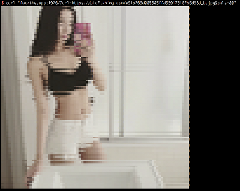

# img2console ![MIT License][license-badge]
一个在终端显示图片的工具。

## Demo

在终端尝试执行下面的命令：

```bash
curl xlzd.me:1926
```


可以尝试使用 `url` 和 `cols` 参数：

```bash
curl "xlzd.me:1926/?url=https://pic2.zhimg.com/e91a265d085585ffd589123102b6d38d_b.jpg&cols=80"
```



[license-badge]:   https://img.shields.io/badge/license-MIT-000000.svg
